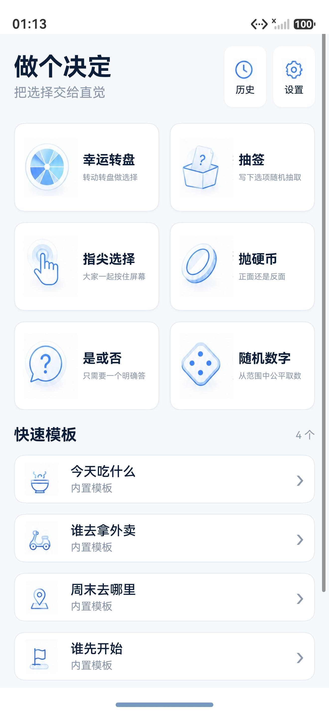
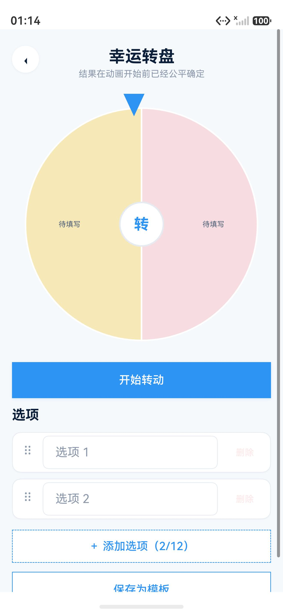
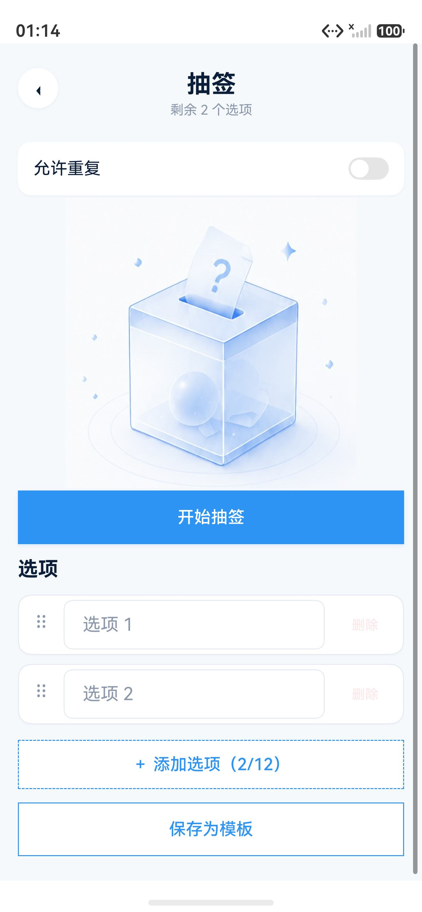
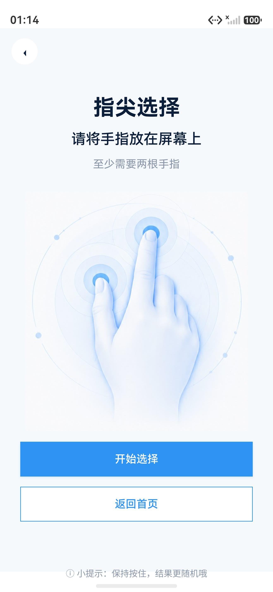
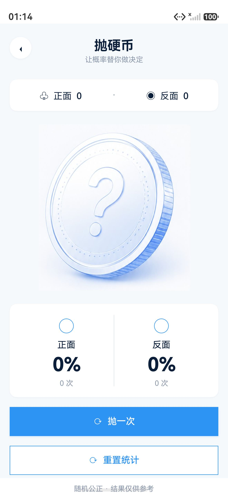
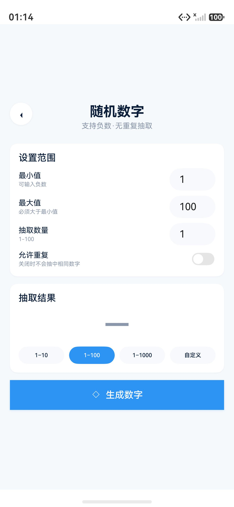
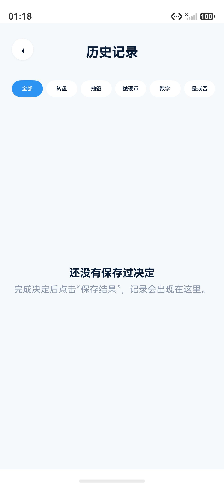

# 做个决定

一款完全离线、无需登录的 HarmonyOS 决策工具：转盘、抽签、指尖选择、抛硬币、是或否、随机数字六种方式都只在本机计算，不申请网络权限，无广告、统计与云同步，设置和历史只写入设备本地。

## 技术栈

- HarmonyOS，兼容与目标 SDK `6.1.1(24)`，`runtimeOS` 为 HarmonyOS，Stage 模型
- ArkTS / ArkUI 声明式 UI，单 `entry` HAP 模块（`apiType: stageMode`），无 WebView 与跨端运行时
- 设备类型：phone、tablet（module.json5 声明）；首页按宽度 2–4 列重排，内容限宽，不支持 2in1
- 无第三方依赖；测试依赖本地引入的 `@ohos/hypium`（`file:./vendor/hypium`）
- 本地持久化：`@kit.ArkData` Preferences，库名 `decision_data`，设置、模板、历史、统计均以 JSON 字符串读写
- 反馈：`@kit.MediaKit` AVPlayer 播放 WAV 音效，`@ohos.vibrator` 提供振动，均可在设置中关闭

## 功能特性

**幸运转盘**

- 随机结果在动画开始前确定，指针落点与结果一致；转动期间锁定输入与重复操作
- 选项编辑器支持增删改与校验，选项文本不因组件重建丢失
- 可将当前选项保存为自定义模板，模板名称与选项均做校验

**抽签**

- 不重复模式维护剩余候选池，抽空提示并可重新开始；允许重复模式保留候选池
- 约两秒五段衰减摇动、短暂停顿、签条超调上升并回落高亮的动效
- 抽签筒与签条使用独立变换层，签条文字始终正向可读

**指尖选择**

- 多人多点触控，状态机覆盖少于两指、触点变化重置、三秒倒计时锁定、锁定后忽略触摸
- 锁定后随机选中一个触点并高亮

**抛硬币 / 是或否**

- 抛硬币可选写下问题，结果只在动画完成后统计本轮正面/反面次数，取消不计入
- 是或否只返回明确的「是」或「否」

**随机数字**

- 校验最小值、最大值与抽取数量，支持负数与多数量抽取
- 关闭「允许重复」时校验不重复容量，容量不足给出错误提示
- 快捷范围 `1–10` / `1–100` / `1–1000` 可直接同步最小值和最大值
- 结果可复制到系统剪贴板，也可保存进历史

**模板、历史与设置**

- 四个内置模板：今天吃什么、谁去拿外卖、周末去哪里、谁先开始；自定义模板可删除并持久化
- 历史记录支持按工具筛选、查看详情、再次使用、长按删除与确认后清空，上限 200 条
- 设置包含振动反馈、音效、主题（跟随系统 / 浅色 / 深色）、自动保存历史开关
- 三种相互隔离的数据清理：仅清历史、仅清自定义模板、清除全部本地数据并恢复默认设置
- 首页按宽度使用 2–4 列，页面可整体滚动，适配小屏与大字体

## 截图

首页 · 六种工具与四个内置模板



| 幸运转盘 | 抽签 | 指尖选择 |
| --- | --- | --- |
|  |  |  |

| 抛硬币 | 随机数字 | 历史记录 |
| --- | --- | --- |
|  |  |  |

截图取自 `docs/qa/screenshots/`，为 API 24 模拟器上的实际运行画面，验收环境与结论见 [docs/ACCEPTANCE.md](docs/ACCEPTANCE.md)。

## 目录结构

```
AppScope/                  应用级配置与图标、应用名
entry/src/main/ets/
  entryability/            EntryAbility 与应用生命周期
  pages/                   首页、转盘、抽签、指尖选择、硬币、是否、随机数字、历史、设置、隐私
  components/              common 通用组件；decision 转盘画布、抽签筒、硬币、选项编辑器、模板弹窗
  domain/                  random 随机服务、wheel 转盘几何与标签排版、draw 抽签动效、state 各页面状态机、validation 校验
  data/                    PreferencesStore 与 repositories 历史/设置/模板仓储
  stores/                  AppStore 应用状态、DecisionDraftStore 选项草稿
  services/                音效、振动与生命周期反馈
  constants/               AppStrings 文案、DesignTokens 视觉令牌、PresetTemplates 内置模板
  resources/rawfile/sounds/  coin / draw / result / tap / wheel 五个 WAV 音效
entry/src/ohosTest/        Hypium 单元测试
docs/                      设计、测试、验收、隐私与 QA 记录
vendor/hypium/             本地引入的 Hypium 测试框架
scripts/                   构建、标准检查、UI 资源生成脚本
```

## 构建与运行

1. 用 DevEco Studio 打开仓库根目录，等待 HarmonyOS SDK 与依赖同步完成；工程为 Stage 模型单 `entry` 模块，`compatibleSdkVersion` / `targetSdkVersion` 均为 `6.1.1(24)`。
2. 选择 `entry` 模块与目标设备（模拟器或真机），直接 Run 即可；应用启动入口是 `EntryAbility`。

命令行构建主 HAP（Windows PowerShell，需已安装 DevEco Studio）：

```powershell
$env:DEVECO_SDK_HOME='C:\Program Files\Huawei\DevEco Studio\sdk'
& 'C:\Program Files\Huawei\DevEco Studio\tools\hvigor\bin\hvigorw.bat' `
  --mode module -p product=default -p module=entry@default `
  assembleHap --no-daemon
```

构建测试 HAP 并在设备上跑单元测试：

```powershell
& 'C:\Program Files\Huawei\DevEco Studio\tools\hvigor\bin\hvigorw.bat' `
  --mode module -p product=default -p module=entry@ohosTest `
  assembleHap --no-daemon

$hdc='C:\Program Files\Huawei\DevEco Studio\sdk\default\openharmony\toolchains\hdc.exe'
& $hdc -t 127.0.0.1:5555 shell aa test `
  -b com.yr23.decision -m entry_test `
  -s unittest OpenHarmonyTestRunner
```

预期 `Failure: 0`、`Error: 0`、`TestFinished-ResultCode: 0`。仓库内 `scripts/build-harmony.ps1` 一次完成主 HAP 与测试 HAP 构建，`scripts/check-standard.ps1` 做结构与静态检查。测试与人工回归步骤见 [docs/TESTING.md](docs/TESTING.md)。

## 隐私说明

- 应用只申请 `ohos.permission.VIBRATE` 一项权限，用于结果触感反馈；**不申请网络权限**，源码不包含 `INTERNET`、`CAMERA`、`LOCATION`、`MICROPHONE`、`READ_MEDIA`，也没有 WebView 或跨端运行时。
- 不需要账号，不连接网络，不收集、上传或共享任何个人信息。
- 设置、自定义模板和用户主动保存的历史记录只写入当前设备的 Preferences；复制随机数字结果时只把当前结果写入系统剪贴板。
- 用户可分别清除历史、自定义模板，或清除全部本地数据；卸载应用会删除应用沙箱中的全部数据。

完整说明见 [docs/PRIVACY.md](docs/PRIVACY.md)，应用内也提供隐私说明页。

## 许可

`entry` 模块 `license` 字段为 `UNLICENSED`，未附开源许可证文件；如需以开源方式发布，请先补充许可证。